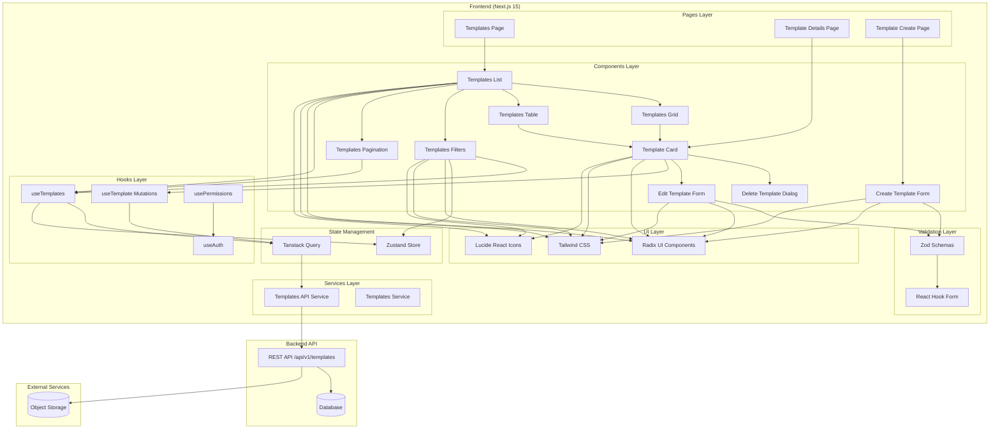
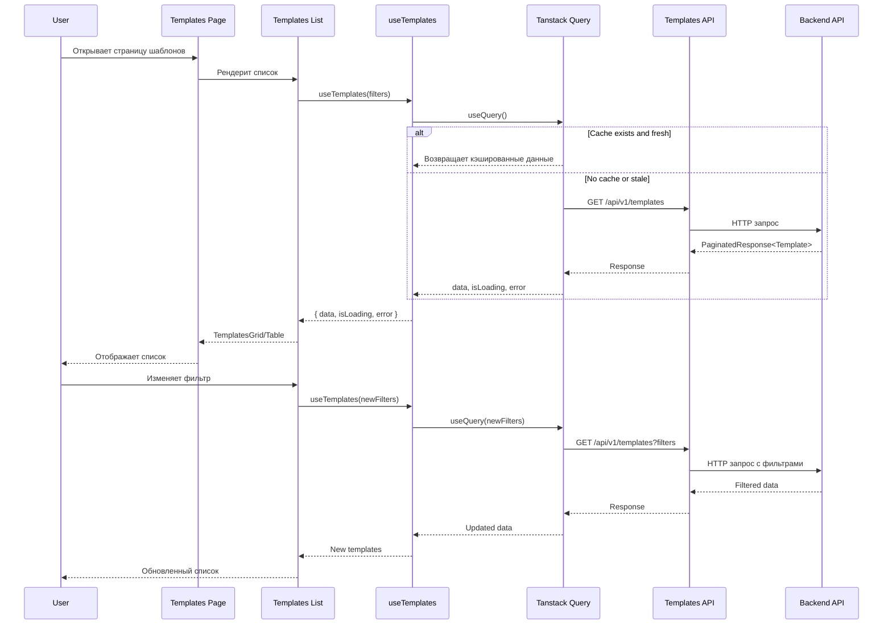
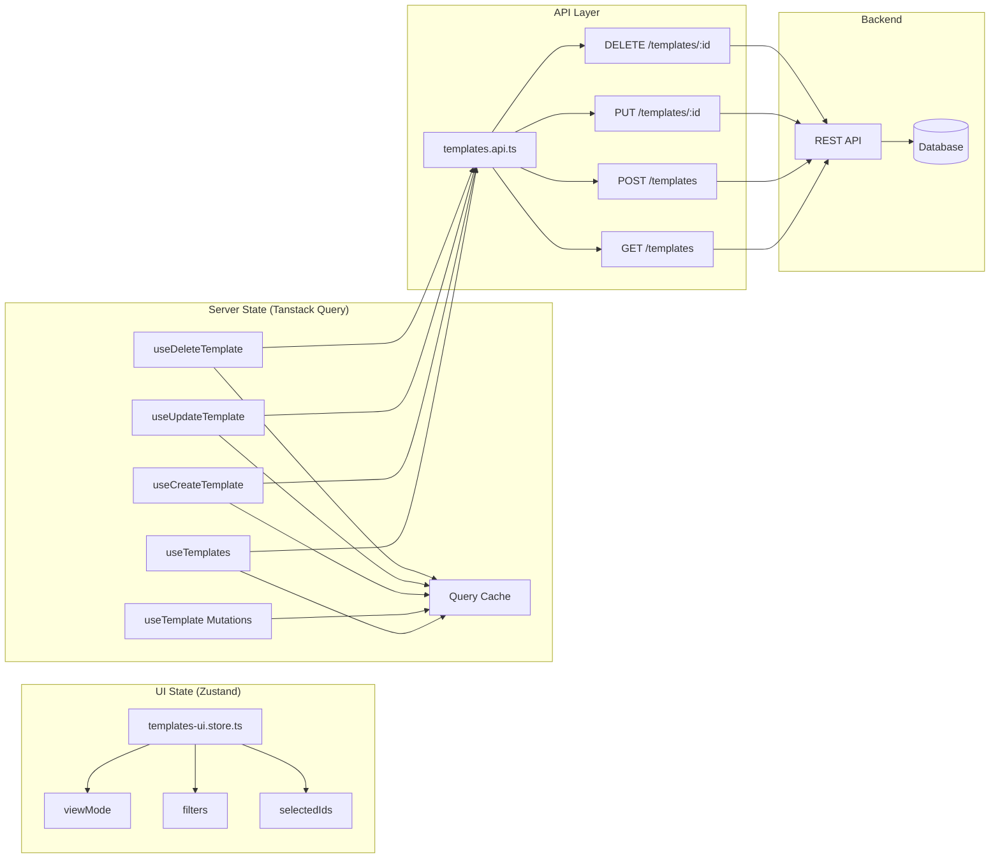
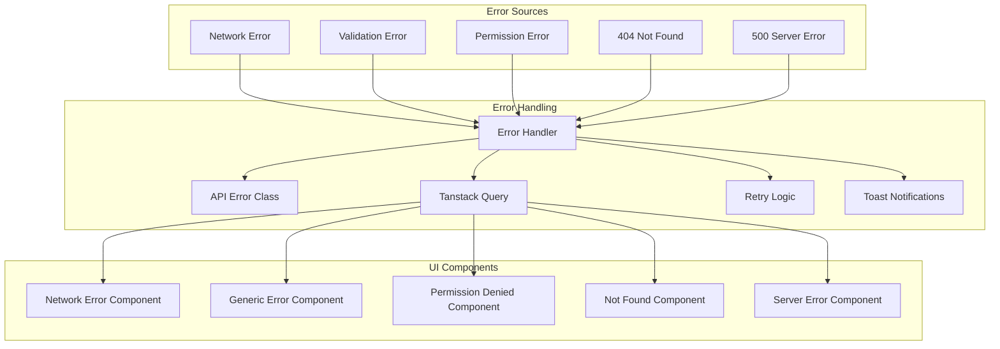
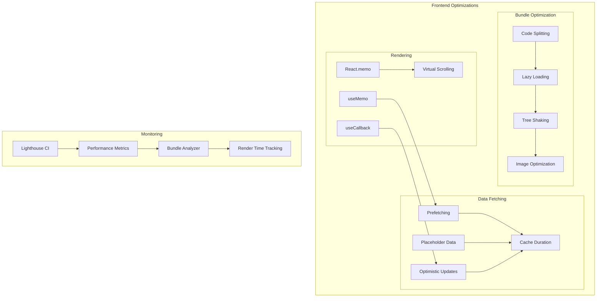
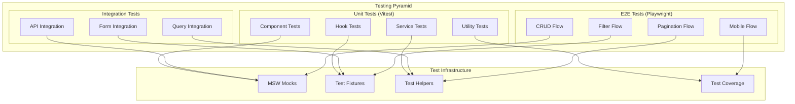
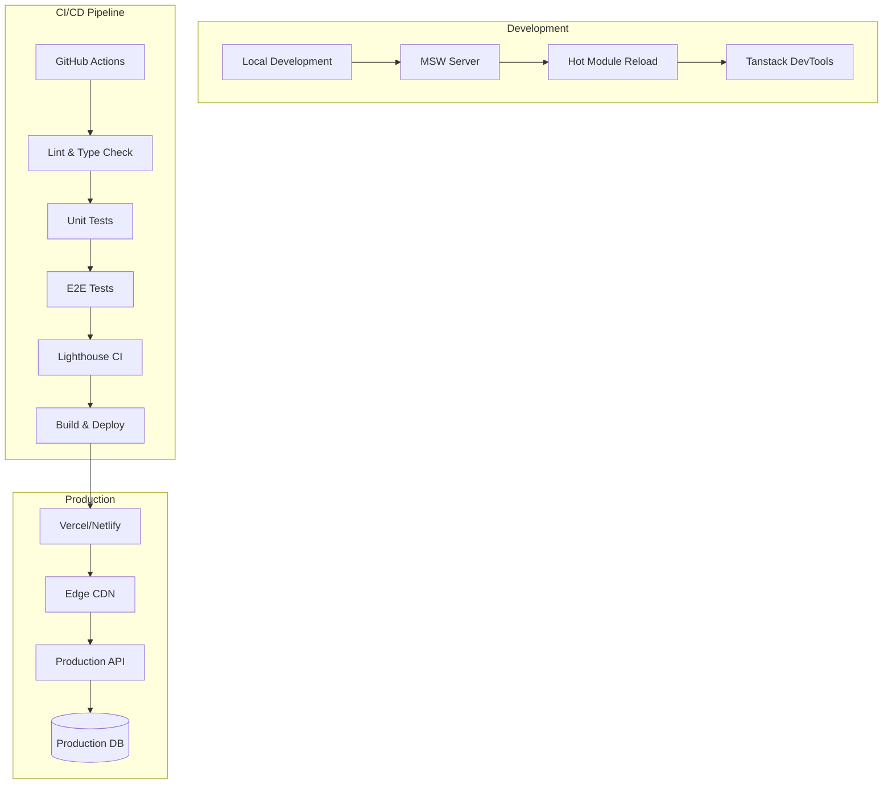

# Phase 3 Sprint 4 - Architecture Diagram

## System Architecture Overview



## Data Flow Diagram



## Component Hierarchy

```mermaid
graph TD
    subgraph "Templates Management"
        TP[app/(dashboard)/templates/page.tsx]
        
        subgraph "Layout Components"
            HF[Header Component]
            SF[Sidebar Component]
            C[Container Component]
        end
        
        subgraph "Template Components"
            TL[components/templates/templates-list.tsx]
            TG[components/templates/templates-grid.tsx]
            TT[components/templates/templates-table.tsx]
            TC[components/templates/template-card.tsx]
            TF[components/templates/templates-filters.tsx]
            TPA[components/templates/templates-pagination.tsx]
        end
        
        subgraph "Form Components"
            CTM[components/templates/create-template-modal.tsx]
            ETM[components/templates/edit-template-modal.tsx]
            DTD[components/templates/delete-template-dialog.tsx]
        end
        
        subgraph "UI Components"
            B[Button]
            I[Input]
            S[Select]
            C2[Card]
            D[Dialog]
            A[Alert]
            SK[Skeleton]
        end
    end
    
    TP --> HF
    TP --> SF
    TP --> C
    TP --> TL
    TP --> CTM
    
    TL --> TG
    TL --> TT
    TL --> TF
    TL --> TPA
    
    TG --> TC
    TT --> TC
    
    TC --> DTD
    TC --> ETM
    
    TC --> B
    TC --> I
    TC --> S
    TC --> C2
    TC --> D
    TC --> A
    TC --> SK
    
    TF --> B
    TF --> I
    TF --> S
    
    TPA --> B
    TPA --> S
    
    CTM --> B
    CTM --> I
    CTM --> S
    CTM --> D
    
    ETM --> B
    ETM --> I
    ETM --> S
    ETM --> D
    
    DTD --> B
    DTD --> D
    DTD --> A
```

## State Management Flow



## Error Handling Flow



## Performance Optimization Strategy



## Testing Architecture



## Deployment Architecture



Эта архитектура обеспечивает:
- **Масштабируемость**: четкое разделение ответственности
- **Поддерживаемость**: понятная структура кода
- **Производительность**: оптимизации на всех уровнях
- **Тестируемость**: полный coverage тестами
- **Надежность**: обработка ошибок и retry логика
- **UX**: оптимистические обновления и loading states